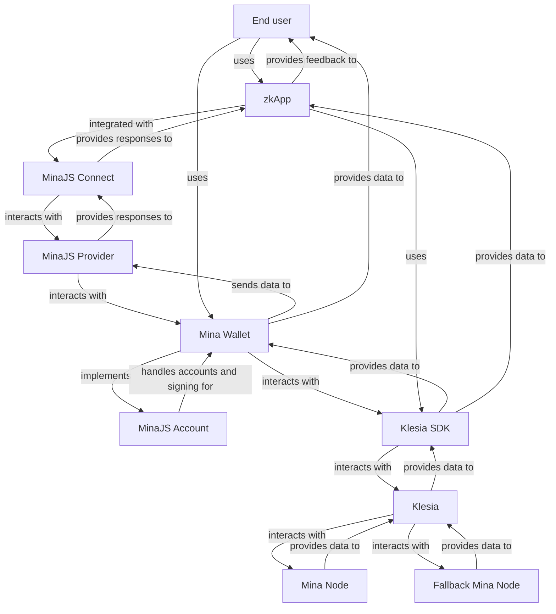

# About MinaJS [Learn about MinaJS and Klesia.]

:::warning
As of September 2024, MinaJS is in early development. Don't use for production just yet.
:::

MinaJS is a TypeScript interface for Mina Protocol. It provides a set of TypeScript types and utilities to interact with Mina Protocol. MinaJS is the missing piece for your smooth zkApp development on Mina.
It aims to remove the complexities, and allow developers to focus on building innovative zkApps on Mina.

## Services

MinaJS provides a set of services to interact with Mina Protocol. The services are designed to be modular and extensible. The services are:

- **MinaJS Connect** - A connector library to discover Mina Protocol wallets like Pallad, and interact with them in a seamless way.
- **MinaJS Accounts** - A Viem-like library to manage accounts and execute operations such as signing transactions.
- **MinaJS Provider** - A set of Zod-based schemas and TypeScript types for Mina wallets to comply with the latest specs and MinaJS Connect standard.
- **Klesia** - A JSON-RPC wrapper over Mina Node's GraphQL API, similar to APIs like Alchemy and Infura. It's self hostable, so you can bring your own infrastructure.
- **Klesia SDK** - A TypeScript SDK to interact with Klesia JSON-RPC API with type-safe interfaces and properties auto-completion.

## Services and interaction breakdown

## Supported Chains

- Mina Mainnet
- Mina Devnet
- [Zeko](https://zeko.io) Devnet (soon™️)

## Supported Rollup Frameworks

- [Protokit](https://protokit.dev/) (soon™️)

## Supported Wallets

- [Pallad](https://get.pallad.co/website)
- [Auro Wallet](https://www.aurowallet.com/) (soon™️)
